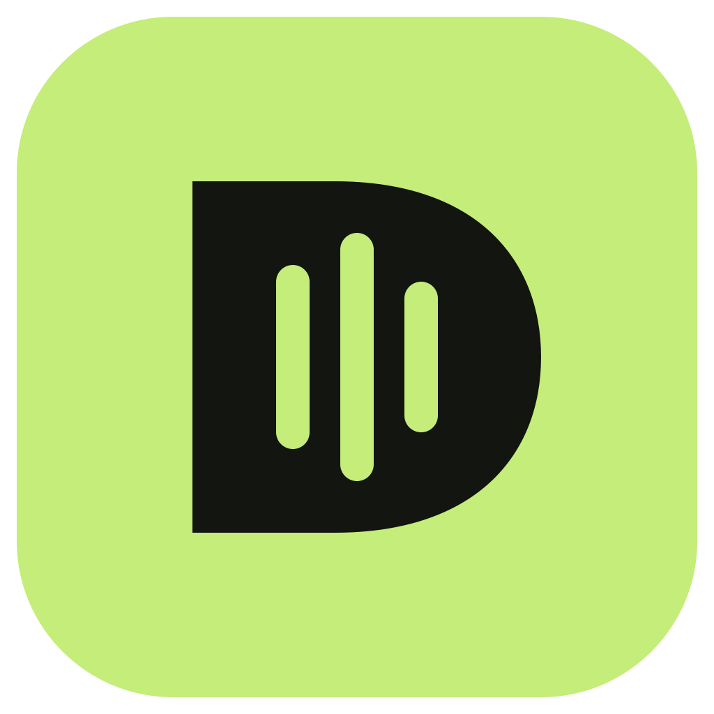

<p align="center"></p>
<h1 align="center">dicta.</h1>
<p align="center"><strong>Tu próximo commit empieza hablando.</strong><br/>Dictado local, gratis y de código abierto para devs de Latinoamérica.</p>
<p align="center"><a href="https://dicta-dev-latam.bonny-flint-2167.chatgpt.site">Conoce Dicta</a> · <a href="https://github.com/SantiSparkov/dicta/releases/latest">Descargas</a> · <a href="BUILD.md">Compilar</a> · <a href="BRAND.md">Marca</a></p>

## Menos teclado. Más idea.

Tienes una idea, abres Cursor y empiezas a explicar. Dicta convierte lo que dices en texto y lo pega donde tengas el cursor: un prompt de Claude, el editor, tu terminal o cualquier campo de texto compatible.

**Activa tu atajo → habla → termina el dictado → revisa el texto y envíalo tú.**

- **En tu compu.** La transcripción se procesa localmente. Descarga el modelo una vez y dicta sin conexión.
- **En español.** Interfaz en español y modelos multilingües priorizados al empezar. Añade vocabulario para nombres de proyectos y términos que repitas.
- **En tu flow.** Atajo global configurable, micrófono seleccionable, historial local y distintos modelos según tu equipo.
- **Sin otra suscripción.** Sin cuenta ni límite comercial de palabras. Código bajo licencia MIT.

La precisión depende del modelo, el micrófono y el ruido. Dicta no promete interpretar perfectamente nombres de variables ni ejecutar comandos: revisa lo transcrito antes de enviarlo.

## Instalación

1. Abre [la última publicación](https://github.com/SantiSparkov/dicta/releases/latest) y elige un archivo compatible con tu sistema y arquitectura. Cada publicación indica qué compilaciones están disponibles.
2. Instala Dicta. En macOS, abre el `.dmg` y arrastra la app a Aplicaciones. En Windows usa el instalador; en Linux, el paquete apropiado para tu distribución.
3. Abre la app, permite el micrófono y, en macOS, **Accesibilidad** para pegar en otras apps.
4. Descarga un **modelo multilingüe compatible con español**. Configura tu micrófono y atajo en **Tu espacio**.
5. Pon el cursor en un campo de texto, activa el atajo, dicta y termina la grabación. El texto aparece allí.

Esta primera edición conserva la versión técnica **0.9.6** de la base Handy. Dicta tiene identificador propio `app.dicta.desktop`, ajustes independientes y actualizador automático desactivado. Las actualizaciones se descargan manualmente desde este repositorio.

### macOS y firma

La compilación comunitaria local tiene firma ad-hoc; **no está notarizada por Apple**. macOS puede bloquear su apertura. Comprueba la procedencia y el SHA-256 publicado. Si confías en el archivo, usa **Ajustes del Sistema → Privacidad y seguridad → Abrir igualmente**, cuando macOS ofrezca esa opción. No hace falta desactivar Gatekeeper globalmente. Las publicaciones especifican el estado de firma de cada archivo.

### Compatibilidad

El proyecto contiene compilaciones para macOS Apple Silicon e Intel, Windows x64/ARM64 y Linux x64/ARM64. El código de esas plataformas se hereda de Handy; **solo considera validado un instalador cuando la publicación lo indique**. En Linux/Wayland los atajos y el pegado dependen del escritorio. El consumo de RAM y disco depende del modelo que elijas.

## Privacidad, sin letra chica

- El **dictado local** no necesita subir audio a un servidor.
- El historial puede guardar transcripciones y grabaciones **en tu dispositivo**. Puedes borrarlas y ajustar la retención.
- Descargar modelos necesita internet y contacta los servidores de distribución del proyecto original.
- El **postprocesado es opcional**. Si eliges un proveedor externo, se le envía texto y puede aplicar sus propias tarifas y políticas. Déjalo desactivado si quieres el flujo local.
- La landing no añade analítica, anuncios ni formularios. GitHub y el proveedor de hosting gestionan sus propios registros técnicos.

## Desarrollo

Requisitos: Bun, Rust estable y dependencias nativas del sistema. Consulta [BUILD.md](BUILD.md) para los pasos completos.

```bash
bun install
./scripts/prepare-native.sh
bun run tauri dev
```

```bash
bun run build             # TypeScript + frontend de escritorio
bun run lint              # ESLint
bun run tauri build       # App y paquetes del sistema actual
```

### Landing

La web tiene su proyecto independiente en `landing/`, con React, Vinext y Sites. No necesita base de datos ni secretos de aplicación.

```bash
cd landing
npm ci
npm run dev
npm run build
```

Su configuración de hosting está en `landing/.openai/hosting.json`. [RELEASE.md](RELEASE.md) documenta cómo preparar y publicar una nueva versión del producto.

## Qué cambió respecto a Handy

Nombre, iconos nativos, identidad de escritorio, navegación, onboarding, copy, idioma inicial, prioridades del selector de modelos, overlay y landing. Conservamos el motor Rust/Tauri, el pipeline de audio, los modelos y los controles reales. La distribución tiene identidad independiente y no usa el canal de actualizaciones ni las credenciales de firma del proyecto original.

## Créditos y licencia

Dicta es una distribución independiente basada en [Handy](https://github.com/cjpais/handy), creado por **CJ Pais y sus contribuyentes**. Base importada: [`bc7face`](https://github.com/cjpais/handy/commit/bc7facea3a777869182203cfcf5c90f7a98efd99). Gracias por construir y compartir el motor sobre el que existe este proyecto.

Se conserva íntegramente [la licencia MIT y el copyright original](LICENSE). Los motores, modelos y dependencias mantienen sus respectivas licencias. El nombre Dicta y esta dirección visual no implican afiliación con Handy, Cursor, Anthropic ni sus productos.

¿Encontraste un problema? [Abre un issue](https://github.com/SantiSparkov/dicta/issues) con tu sistema, modelo y pasos para reproducirlo. No publiques grabaciones privadas, claves ni contenido sensible.
